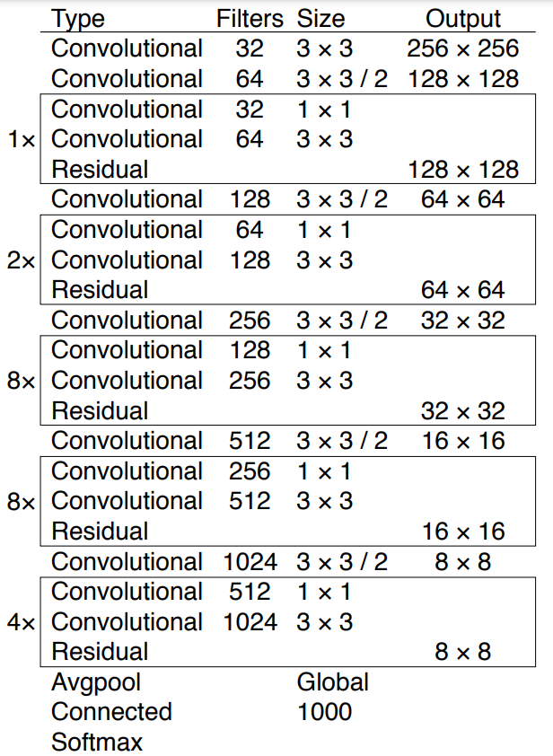
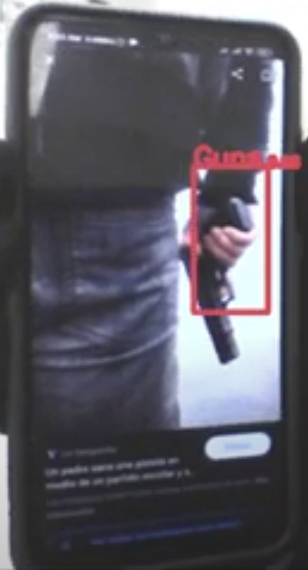

# Detection of firearms in real time using Transfer Learning and Fine Tuning techniques with the Yolov3 convolutional neural network

Probably we once recognized someone from afar, maybe even we only saw a very blurry image and his/her face cover with a mask without the possibility of see his/her hair, but even will all this we could recognize them. Recognized things is so trivial to us like humans, and it leave me one question, how is possible that we can do it so well?, is there perhaps something else in your head that allow us  recognize things even without sufficient information?, is intuition something reserved for humans?. This protect pretend to be the first approaching to this idea, because detect something when it already is happening could be very late when we talk about assaults and robberies that we see each days in news.

> In the second semester of 2019, 27.2\% of Peruvians over 15 years was victim of some criminal act.

## About Yolov3

"You Only Look Once" is a set of arquitectures of deep learning models designed for object detection. It was first described in 2015, but we will use the 2018 Yolov3's arquitecture which is exposed in the paper "YOLOv3: An Incremental Improvement". Yolo was trained with COCO "Common Objects In Context", dataset which has 328 000 images of everyday objects and humans. Yolov3 can identified 80 different classes of objets, so transfer learning will be applied by adding the guns class.

### Bounding Box Prediction

The network predict 4 coordinates $t_x, t_y,t_w,t_h$ for each bounding box(BB). If the cell is offset from the top left corner of the image by $(c_x, c_y)$ and the bounding box prior has width and height $p_w, p_h$, then predictions will be:

 $b_x = \sigma(t_x) + c_x$ 
 
 $b_y = \sigma(t_y) + c_y$
 
 $b_w = p_we^{t_w}$
 
 $b_h = p_he^{t_h}$
 
Yolov3 use sum of square error loss during training and compute gradient like the difference between a the ground truth for some coordinate prediction $t^*$ and our prediction $t$ . Each bounding box will have an score which will be 1 if prior BB overlaps a truth better than any others BB. In the case that it is not the best and does overlap a ground truth object by more than threshold, it score will be 0.
This model predict 3 scales of boxes similar to a feature pyramid. It began with the base feature extractor and then add many convolutional layers. These return a bounding box, objectness and class predictions that in this case will be 1, guns's class. Then we take the feature map from 2 layers previous and upsample it by 2x. The idea is improve features using concatenation of features map from earlier layers and upsampled features. Yolov3 use this metod to get more meaningfull semantinc information with more details.
After that, add convolutional layers to process this new feature map and predict a tensor similar than the last step except that this is twice as long.
Finally, repeat this process for the final scale.



## Dataset

For training, a Kaggle dataset called [Gun Detection Dataset with yolo v2 and v3 labels](https://www.kaggle.com/datasets/atulyakumar98/gundetection) was used which contain 3000 images of pistols in diferents positions and types. The format is .jpg and include labels for each image made up of 5 parts, number of class(1 in this case), and coordinates of the position of the bounding box. Also, Yolov3 was trained with COCO dataset and we used this previous weights to train the model with new data.

## Use

> It is suggested to create an environment with python 3.6 before starting.
>
> ```shell
> conda create -n gunsDetecction python=3.6
> ```
>
> 

First install all the necessary libraries by:

```shell
pip install -r requirements.txt
```

Download the weights trained for detection of weapons from [here](https://drive.google.com/file/d/15JY6E8JCBKiqpz-SSB0uD8JXQ0FjwCGV/view?usp=sharing), inside the WeightTest folder.

Later, detection by web cam could be executed by:

```shell
python deteccion_video.py --model_def config/yolov3-custom.cfg --class_path data/custom/classes.names --n_cpu 2 --weights_path WeightTest/yolov3_ckpt_99.pth
```




## Conclusion

In conclusion , in the present work we use the arquitecture of Yolov3 to detect guns, and it's a first step of another project for intention detection.

